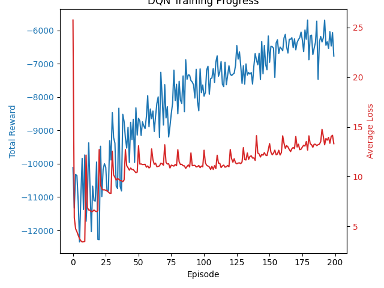

# Federated Reinforcement Learning for Adaptive Traffic Signal Control

This project implements a single, intelligent traffic light agent that learns to optimize traffic flow for a 4-way intersection using Deep Reinforcement Learning (DQN). It serves as the foundational step for a larger system designed to use Federated Learning (via Flower) to enable multiple intersections to learn collaboratively.

## 1. System Architecture
The system consists of two main components that interact in a classic agent-environment loop:
-   **The Environment (SUMO):** A realistic traffic simulator that provides the state of the intersection and calculates the reward signal.
-   **The Agent (Python):** A DQN-based agent that perceives the state, makes decisions, and learns from the consequences of its actions.

---

## 2. The SUMO Simulation Environment
The simulation environment, configured in the `sumo_config/` directory, models the physical world for our agent.

-   `hello.net.xml`: Defines the physical road network, which consists of a single 4-way intersection (`J1`).
-   `hello.rou.xml`: Defines the traffic flow. It specifies routes for different types of vehicles (cars, buses, motorcycles) that are spawned at regular intervals.

### How is traffic simulated?
Traffic is generated based on the routes and vehicle definitions in `hello.rou.xml`. Each vehicle follows its predetermined path. The agent's only influence over the simulation is its ability to change the traffic light phases at intersection `J1`.

### Will tinkering with traffic change the results?
**Yes, absolutely.** The policy learned by the agent is highly specific to the traffic patterns it was trained on. If you modify `hello.rou.xml` to create more or less traffic, or change the routes vehicles take, the pre-trained model's performance will degrade. It would need to be retrained on the new traffic patterns to learn an effective new policy.

---

## 3. The Reinforcement Learning Agent
The "brain" of the traffic light is defined in `src/agent.py`. It uses a Deep Q-Network (DQN), a popular model-free reinforcement learning algorithm.

### State Space (What the Agent Sees)
To make a decision, the agent perceives the environment as a 12-dimensional state vector:
-   **Elements 0-3**: Queue lengths (number of halting vehicles) on the North, South, East, and West approaches.
-   **Elements 4-7**: Average vehicle waiting time on the N, S, E, W approaches.
-   **Element 8**: The current phase of the traffic light (1 if North/South is green, 0 otherwise).
-   **Element 9**: The time elapsed (in simulation steps) since the current green phase began.
-   **Element 10**: A flag indicating if the light is currently yellow (1 for yes, 0 for no).
-   **Element 11**: A constant bias term (always 1.0).

### Action Space (What the Agent Does)
The agent has a simple choice at each decision point:
-   `0`: **Keep** the current traffic light phase.
-   `1`: **Switch** to the next phase in the cycle.

### Reward Function (What the Agent Wants)
The agent's goal is to maximize its cumulative reward. The reward is defined as the **negative total waiting time** of all vehicles in the simulation.
-   **Why is it negative?** By framing the goal as maximizing a negative number, the agent is incentivized to get that number as close to zero as possible. Maximizing `-(waiting_time)` is equivalent to minimizing `waiting_time`.

### RL Best Practices and Implementation
To ensure the agent learns effectively and stably, several key DQN enhancements were implemented in `src/agent.py`:

1.  **Experience Replay:** The agent stores its experiences `(state, action, reward, next_state)` in a memory buffer. During training, it samples random mini-batches from this buffer. This breaks the correlation between consecutive experiences, leading to more stable and robust learning.
2.  **Target Network:** Two neural networks are used: a primary model and a "target" model. The primary model is constantly learning, while the target model's weights are only updated periodically. This provides a stable target for the loss calculation, preventing the agent from "chasing a moving target" and helping to prevent feedback loops during training.
3.  **Huber Loss (`SmoothL1Loss`):** Instead of Mean Squared Error (MSE), Huber Loss is used. This loss function acts like MSE for small errors but like Mean Absolute Error (MAE) for large errors. It is much less sensitive to the occasional very large prediction errors (outliers) that are common in RL, preventing unstable updates and exploding gradients.
4.  **Gradient Clipping:** After the loss is calculated, the gradients are "clipped" to a maximum norm of 1.0. This acts as a final safeguard against exploding gradients, further ensuring the stability of the learning process.

---

## 4. How to Use This Project

### Prerequisites
1.  Install **SUMO** and set the `SUMO_HOME` environment variable.
2.  Install Python dependencies: `pip install -r requirements.txt`

### Running Experiments

This project is structured around a series of experiments, each with a different traffic scenario. You can run a specific experiment or all of them sequentially.

**To run a single experiment:**

Use the `--experiment` flag followed by the experiment's name. The experiment names correspond to the directories in `sumo_config/`.

```bash
# Example: Run the "stage4_unbalanced_flows" experiment
python src/control.py --experiment "stage4_unbalanced_flows"
```

**To run all experiments:**

To execute all stages from `stage0_baseline` to `stage7_total_chaos` in one go, use `all`.

```bash
python src/control.py --experiment all
```

### Output Files

The script saves the output for each experiment in a dedicated subdirectory named after the experiment:
-   **Logs:** `logs/<experiment_name>/run_X.log`
-   **Models:** `models/<experiment_name>/dqn_traffic_model.pth`
-   **Result Plots:** `results/<experiment_name>/training_progress.png`

### Basic Usage: Training and Evaluation

If you run the control script without any flags, it will default to running the `stage0_baseline` experiment.

#### Step 1: Train the Baseline Agent
```bash
python src/control.py
```
This command trains the agent on the baseline scenario and saves the model, plot, and log in their respective `stage0_baseline` subdirectories.

#### Step 2: Evaluate the Trained Agent
To evaluate a trained model, you can use the `evaluate.py` script. **Note:** You will need to modify `evaluate.py` to point it to the specific model file you wish to test (e.g., `models/stage4_unbalanced_flows/dqn_traffic_model.pth`).
```bash
# First, update the model path inside src/evaluate.py, then run:
python src/evaluate.py
```

## 5. Interpreting the Results
After training, a `training_progress.png` file is saved in the `results/` folder.
-   **Total Reward (Blue Line):** This is the most important metric. An upward trend indicates the agent is getting better at its job (minimizing wait times). The goal is to see this curve climb as high as possible (i.e., as close to zero as possible) and then plateau.
-   **Average Loss (Red Line):** This shows how "wrong" the agent's predictions are. A good loss curve will drop sharply at the beginning and then remain low and stable. The previous instability was fixed, and the current loss curve demonstrates a healthy learning process.

---

## 6. Baseline Performance (200-Episode Run)

The initial 200-episode training run serves as the first baseline for this project.

- **Configuration:** The agent was trained on the default traffic scenario defined in `sumo_config/hello.rou.xml`.
- **Result:** The agent demonstrated successful learning, improving its performance (total reward) from approximately **-11,000** at the start of training to a peak score of **-5692**.
- **Analysis:** The reward curve shows a clear upward trend, proving the DQN approach is viable. The loss curve, while showing a slight upward creep, is stable enough to serve as a solid foundation for future experiments.



---

## 7. Next Steps: Phase 3 (Federated Learning)
With a stable and effective single agent, the project is now ready for the final phase: federated learning. This involves adapting the training script to run as a **Flower client** and creating a central **Flower server** to orchestrate the learning process across multiple, independent agents.